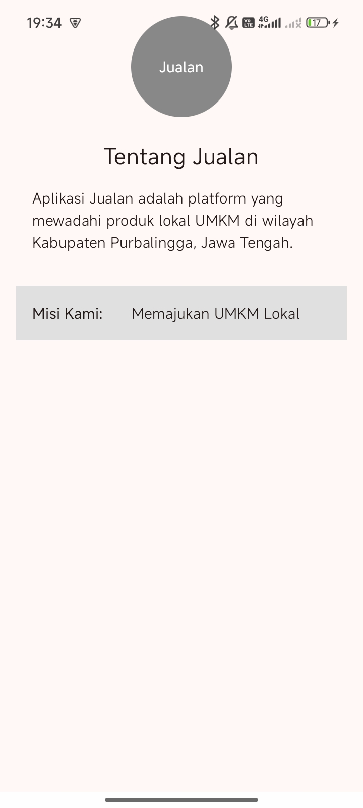
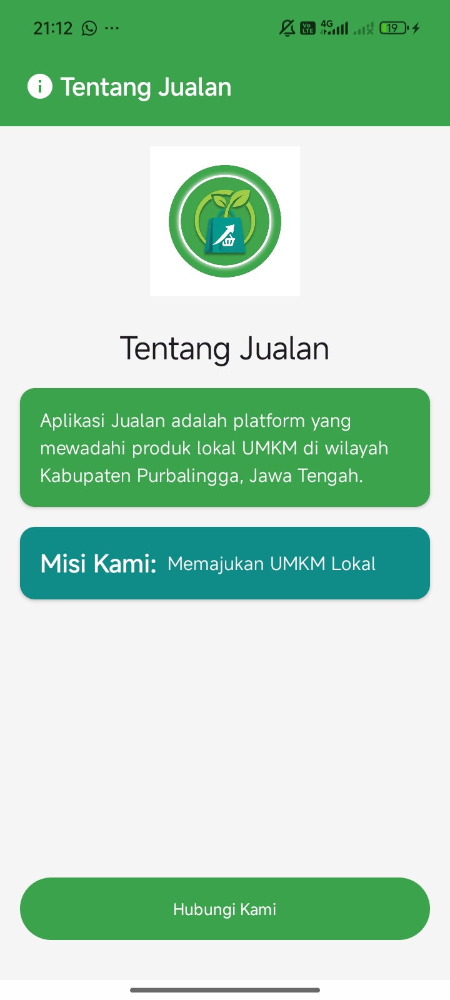
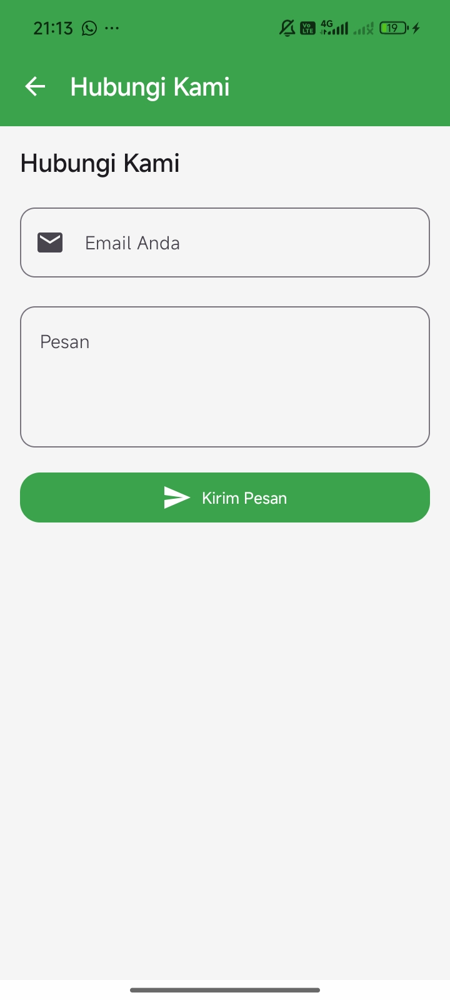
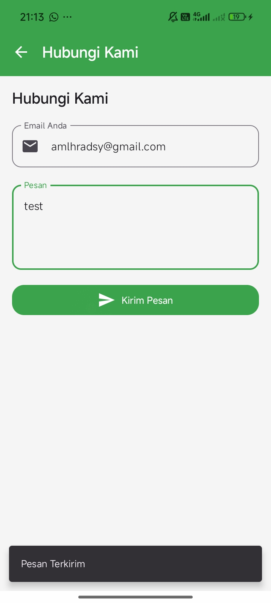
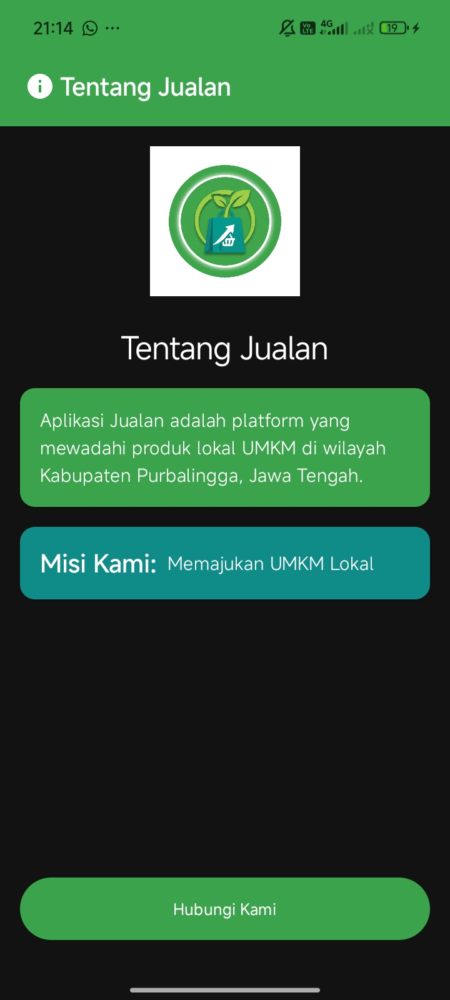
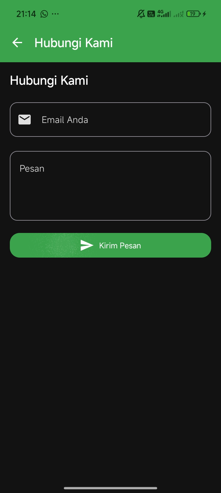
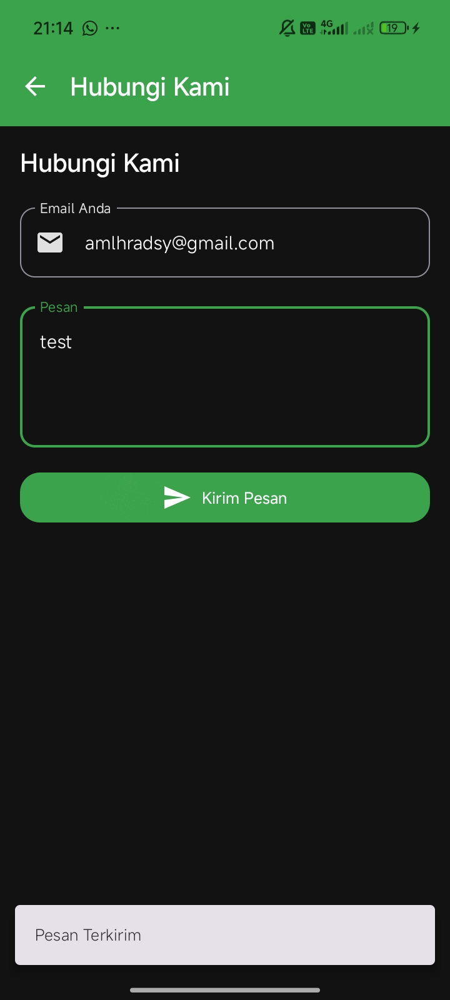

# Aplikasi Jualan

## Identitas

- **Nama**: Amalia Maharani Andessy
- **NIM**: H1D024032
- **Shift KRS**: E
- **Shift Akhir**: F

## Tampilan Aplikasi

### 1. Tampilan Pertemuan 1

### 2. Tampilan Pertemuan 2

#### a. Light Mode

**Halaman Utama**

**Hubungi Kami**

**Test Feedback**

#### b. Dark Mode

**Halaman Utama**

**Hubungi Kami**

**Test Feedback**

## Cara Menjalankan

1. Clone repository ini
2. Buka project menggunakan Android Studio
3. Sync Gradle
4. Klik tombol Run (▶️)